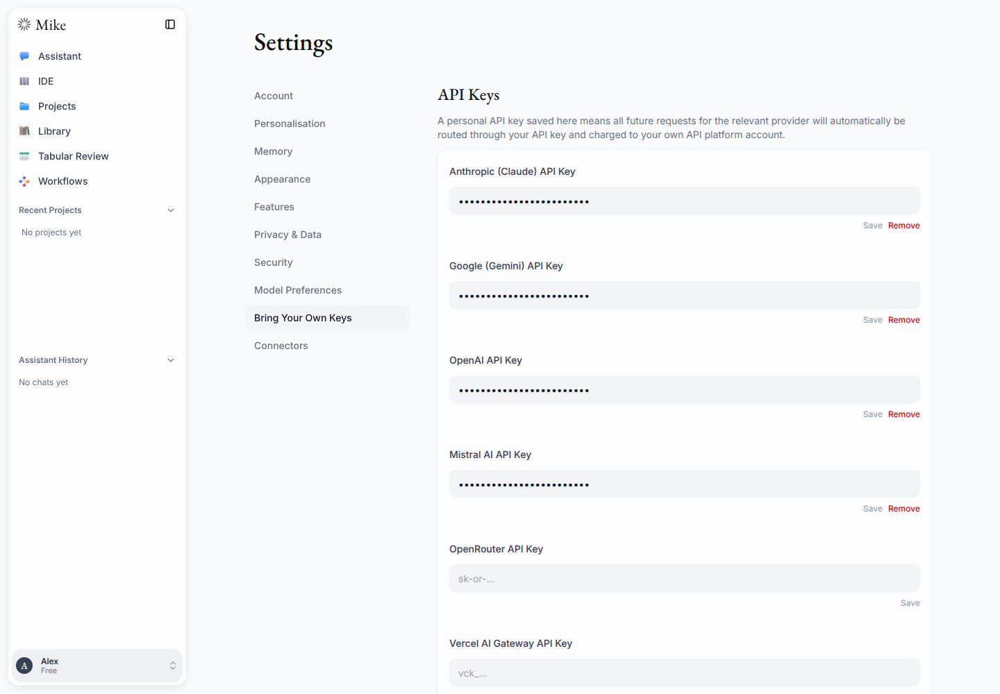
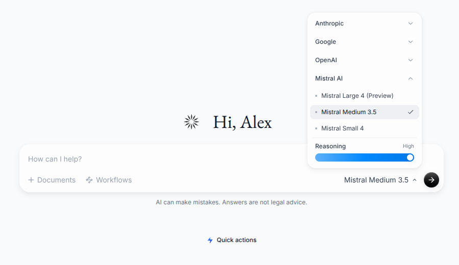

# Mistral settings and model picker

Captured from the actual web application for PR #601 using synthetic account
and API fixtures. The settings show the component's saved-key mask; no real API
keys or live provider requests were used.

## API-key settings

The Bring Your Own Keys page includes the Mistral AI API Key field alongside
the existing providers.

## Model picker

The Mistral AI menu offers Large 4 (Preview), Medium 3.5, and Small 4. Medium 3.5
is selected in this capture.

